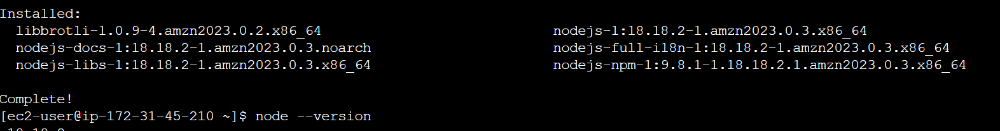
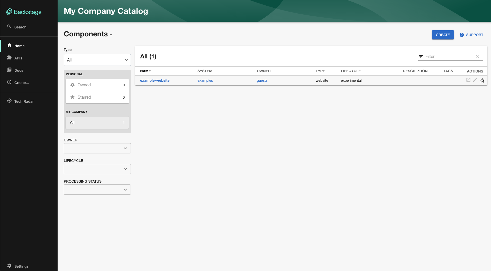

# Install Backstage's prerequisites:

Link: https://backstage.io/docs/getting-started/

NVM:
# installs NVM (Node Version Manager)
curl -o- https://raw.githubusercontent.com/nvm-sh/nvm/v0.39.7/install.sh | bash

# download and install Node.js
nvm install 20

# verifies the right Node.js version is in the environment
node -v # should print `v20.12.2`

# verifies the right NPM version is in the environment
npm -v # should print `10.5.0`Yarn:

yarn:
https://classic.yarnpkg.com/en/docs/install#windows-stable

Docker:
https://www.cyberciti.biz/faq/how-to-install-docker-on-amazon-linux-2/

Git:
https://github.com/git-guides/install-git

# Scaffold Backstage

npx @backstage/create-app@latest : fill in the prompts for app name
**BUG: if yarn install is stuck indefinitely, use 
npx @backstage/create-app@latest --skip-install 
then navigate to the app folder and run "yarn install" manually

cd <my-backstage-app-name> # your app name

yarn dev

http://localhost:3000 or if using a cloud server, <public-ip-of-server>:3000
** If 404 is displayed on opening the webpage, then make changes in app-config.yaml and add the DNS name of your webserver in the baseURL section

# General folder structure:
app
├── app-config.yaml
├── catalog-info.yaml
├── package.json
└── packages
    ├── app
    └── backend
app-config.yaml: Main configuration file for the app.
catalog-info.yaml: Catalog Entities descriptors.
package.json: Root package.json for the project.
packages/: Lerna leaf packages or "workspaces". Everything here is going to be a separate package, managed by lerna.
packages/app/: An fully functioning Backstage frontend app, that acts as a good starting point for you to get to know Backstage.
packages/backend/: We include a backend that helps power features such as

_____________________________________________________
Auth via GitHub SSO:
_____________________________________________________
Basic pre-requisites: 
Have below handy from your GitHub O-Auth Apps:
i) clientID
ii) clientSecret
iii) Personal access token

Backstage uses an app-config to configure the application from a yaml file. This app-config will contain what is necessary for configuring the frontend and the backend. The app-config configures plugins, authentication, and more. We will use the app-config to enable SSO and Git integrations. The app-config will require sensitive information, proceed with caution .

# Backstage Github SSO possesses many challenges with known bugs, I have managed to get it working by:(In case your set-up encounters any issues, compare with below files:)

1. Update app-config.yaml

        app:
        title: Scaffolded Backstage App
        baseUrl: http://ec2-13-233-58-87.ap-south-1.compute.amazonaws.com:3000

        organization:
        name: My Company

        backend:
        # Used for enabling authentication, secret is shared by all backend plugins
        # See https://backstage.io/docs/auth/service-to-service-auth for
        # information on the format
        # auth:
        #   keys:
        #     - secret: ${BACKEND_SECRET}
        baseUrl: http://ec2-13-233-58-87.ap-south-1.compute.amazonaws.com:7007
        listen:
            port: 7007
            # Uncomment the following host directive to bind to specific interfaces
            # host: 127.0.0.1
        csp:
            connect-src: ["'self'", 'http:', 'https:']
            # Content-Security-Policy directives follow the Helmet format: https://helmetjs.github.io/#reference
            # Default Helmet Content-Security-Policy values can be removed by setting the key to false
        cors:
            origin: http://localhost:3000
            methods: [GET, HEAD, PATCH, POST, PUT, DELETE]
            credentials: true
        # This is for local development only, it is not recommended to use this in production
        # The production database configuration is stored in app-config.production.yaml
        database:
            client: better-sqlite3
            connection: ':memory:'
        # workingDirectory: /tmp # Use this to configure a working directory for the scaffolder, defaults to the OS temp-dir

        integrations:
        github:
            - host: github.com
            # This is a Personal Access Token or PAT from GitHub. You can find out how to generate this token, and more information
            # about setting up the GitHub integration here: https://backstage.io/docs/integrations/github/locations#configuration
            token: <add here>
            ### Example for how to add your GitHub Enterprise instance using the API:
            # - host: ghe.example.net
            #   apiBaseUrl: https://ghe.example.net/api/v3
            #   token: ${GHE_TOKEN}

        proxy:
        ### Example for how to add a proxy endpoint for the frontend.
        ### A typical reason to do this is to handle HTTPS and CORS for internal services.
        # endpoints:
        #   '/test':
        #     target: 'https://example.com'
        #     changeOrigin: true

        # Reference documentation http://backstage.io/docs/features/techdocs/configuration
        # Note: After experimenting with basic setup, use CI/CD to generate docs
        # and an external cloud storage when deploying TechDocs for production use-case.
        # https://backstage.io/docs/features/techdocs/how-to-guides#how-to-migrate-from-techdocs-basic-to-recommended-deployment-approach
        techdocs:
        builder: 'local' # Alternatives - 'external'
        generator:
            runIn: 'docker' # Alternatives - 'local'
        publisher:
            type: 'local' # Alternatives - 'googleGcs' or 'awsS3'. Read documentation for using alternatives.

        auth:
        # see https://backstage.io/docs/auth/ to learn about auth providers
        #environment: development
        providers:
            github:
            development:
                clientId: <add here>
                clientSecret: <add here>
                ## uncomment if using GitHub Enterprise
                # enterpriseInstanceUrl: ${AUTH_GITHUB_ENTERPRISE_INSTANCE_URL}
                signIn:
                resolvers:
                    - resolver: emailMatchingUserEntityProfileEmail
                    - resolver: emailLocalPartMatchingUserEntityName
                    - resolver: usernameMatchingUserEntityName
            # See https://backstage.io/docs/auth/guest/provider
            guest: {}

        scaffolder:
        # see https://backstage.io/docs/features/software-templates/configuration for software template options

        catalog:
        import:
            entityFilename: catalog-info.yaml
            pullRequestBranchName: backstage-integration
        rules:
            - allow: [Component, System, API, Resource, Location]
        locations:
            # Local example data, file locations are relative to the backend process, typically `packages/backend`
            - type: file
            target: ../../examples/entities.yaml

            # Local example template
            - type: file
            target: ../../examples/template/template.yaml
            rules:
                - allow: [Template]

            # Local example organizational data
            - type: file
            target: ../../examples/org.yaml
            rules:
                - allow: [User, Group]

            ## Uncomment these lines to add more example data
            # - type: url
            #   target: https://github.com/backstage/backstage/blob/master/packages/catalog-model/examples/all.yaml

            ## Uncomment these lines to add an example org
            # - type: url
            #   target: https://github.com/backstage/backstage/blob/master/packages/catalog-model/examples/acme-corp.yaml
            #   rules:
            #     - allow: [User, Group]

2. Update packages/app/src/App.tsx

        import { githubAuthApiRef } from '@backstage/core-plugin-api';
        import { SignInPage } from '@backstage/core-components';
        import React from 'react';
        import { Navigate, Route } from 'react-router-dom';
        import { apiDocsPlugin, ApiExplorerPage } from '@backstage/plugin-api-docs';
        import {
        CatalogEntityPage,
        CatalogIndexPage,
        catalogPlugin,
        } from '@backstage/plugin-catalog';
        import {
        CatalogImportPage,
        catalogImportPlugin,
        } from '@backstage/plugin-catalog-import';
        import { ScaffolderPage, scaffolderPlugin } from '@backstage/plugin-scaffolder';
        import { orgPlugin } from '@backstage/plugin-org';
        import { SearchPage } from '@backstage/plugin-search';
        import { TechRadarPage } from '@backstage/plugin-tech-radar';
        import {
        TechDocsIndexPage,
        techdocsPlugin,
        TechDocsReaderPage,
        } from '@backstage/plugin-techdocs';
        import { TechDocsAddons } from '@backstage/plugin-techdocs-react';
        import { ReportIssue } from '@backstage/plugin-techdocs-module-addons-contrib';
        import { UserSettingsPage } from '@backstage/plugin-user-settings';
        import { apis } from './apis';
        import { entityPage } from './components/catalog/EntityPage';
        import { searchPage } from './components/search/SearchPage';
        import { Root } from './components/Root';

        import {
        AlertDisplay,
        OAuthRequestDialog,
        } from '@backstage/core-components';
        import { createApp } from '@backstage/app-defaults';
        import { AppRouter, FlatRoutes } from '@backstage/core-app-api';
        import { CatalogGraphPage } from '@backstage/plugin-catalog-graph';
        import { RequirePermission } from '@backstage/plugin-permission-react';
        import { catalogEntityCreatePermission } from '@backstage/plugin-catalog-common/alpha';
        import { GithubPage } from '@internal/backstage-plugin-github';

        const app = createApp({
        apis,
        bindRoutes({ bind }) {
            bind(catalogPlugin.externalRoutes, {
            createComponent: scaffolderPlugin.routes.root,
            viewTechDoc: techdocsPlugin.routes.docRoot,
            createFromTemplate: scaffolderPlugin.routes.selectedTemplate,
            });
            bind(apiDocsPlugin.externalRoutes, {
            registerApi: catalogImportPlugin.routes.importPage,
            });
            bind(scaffolderPlugin.externalRoutes, {
            registerComponent: catalogImportPlugin.routes.importPage,
            viewTechDoc: techdocsPlugin.routes.docRoot,
            });
            bind(orgPlugin.externalRoutes, {
            catalogIndex: catalogPlugin.routes.catalogIndex,
            });
        },
        components: {
            SignInPage: props => <SignInPage {...props} auto provider={{id: 'github-auth-provider',
                title: 'GitHub',
                message: 'Sign in using GitHub',
                apiRef: githubAuthApiRef,
        }} 
        />,
        },
        });

        const routes = (
        <FlatRoutes>
            <Route path="/" element={<Navigate to="catalog" />} />
            <Route path="/catalog" element={<CatalogIndexPage />} />
            <Route
            path="/catalog/:namespace/:kind/:name"
            element={<CatalogEntityPage />}
            >
            {entityPage}
            </Route>
            <Route path="/docs" element={<TechDocsIndexPage />} />
            <Route
            path="/docs/:namespace/:kind/:name/*"
            element={<TechDocsReaderPage />}
            >
            <TechDocsAddons>
                <ReportIssue />
            </TechDocsAddons>
            </Route>
            <Route path="/create" element={<ScaffolderPage />} />
            <Route path="/api-docs" element={<ApiExplorerPage />} />
            <Route
            path="/tech-radar"
            element={<TechRadarPage width={1500} height={800} />}
            />
            <Route
            path="/catalog-import"
            element={
                <RequirePermission permission={catalogEntityCreatePermission}>
                <CatalogImportPage />
                </RequirePermission>
            }
            />
            <Route path="/search" element={<SearchPage />}>
            {searchPage}
            </Route>
            <Route path="/settings" element={<UserSettingsPage />} />
            <Route path="/catalog-graph" element={<CatalogGraphPage />} />
            <Route path="/github" element={<GithubPage />} />
        </FlatRoutes>
        );

        export default app.createRoot(
        <>
            <AlertDisplay />
            <OAuthRequestDialog />
            <AppRouter>
            <Root>{routes}</Root>
            </AppRouter>
        </>,
        );

3. Update packages/backend/src/index.ts

        import { createBackend } from '@backstage/backend-defaults';

        const backend = createBackend();

        backend.add(import('@backstage/plugin-auth-backend-module-github-provider'));
        backend.add(import('@backstage/plugin-auth-backend-module-google-provider'));
        backend.add(import('@backstage/plugin-app-backend/alpha'));
        backend.add(import('@backstage/plugin-proxy-backend/alpha'));
        backend.add(import('@backstage/plugin-scaffolder-backend/alpha'));
        backend.add(import('@backstage/plugin-techdocs-backend/alpha'));

        // auth plugin
        backend.add(import('@backstage/plugin-auth-backend'));
        // See https://backstage.io/docs/backend-system/building-backends/migrating#the-auth-plugin
        backend.add(import('@backstage/plugin-auth-backend-module-guest-provider'));
        // See https://backstage.io/docs/auth/guest/provider

        // catalog plugin
        backend.add(import('@backstage/plugin-catalog-backend/alpha'));
        backend.add(
        import('@backstage/plugin-catalog-backend-module-scaffolder-entity-model'),
        );

        // permission plugin
        backend.add(import('@backstage/plugin-permission-backend/alpha'));
        backend.add(
        import('@backstage/plugin-permission-backend-module-allow-all-policy'),
        );

        // search plugin
        backend.add(import('@backstage/plugin-search-backend/alpha'));
        backend.add(import('@backstage/plugin-search-backend-module-catalog/alpha'));
        backend.add(import('@backstage/plugin-search-backend-module-techdocs/alpha'));

        backend.start();

4. Update examples/org.yaml to change "guest" to my GH username.

        ---
        # https://backstage.io/docs/features/software-catalog/descriptor-format#kind-user
        apiVersion: backstage.io/v1alpha1
        kind: User
        metadata:
        name: <add here>
        spec:
        memberOf: [guests]
        ---
        # https://backstage.io/docs/features/software-catalog/descriptor-format#kind-group
        apiVersion: backstage.io/v1alpha1
        kind: Group
        metadata:
        name: guests
        spec:
        type: team
        children: []

______________________________________________________________
# Scaffolding the first software catalog
______________________________________________________________

