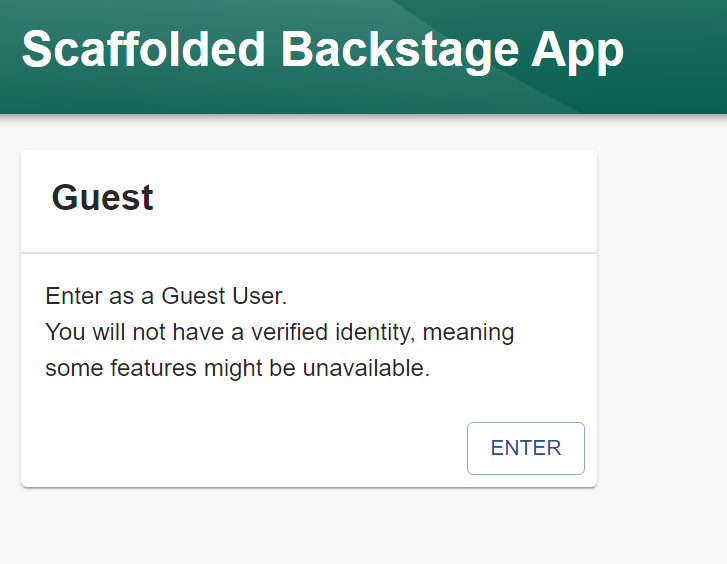

# Install Backstage's prerequisites:

Link: https://backstage.io/docs/getting-started/

NVM:
curl -o- https://raw.githubusercontent.com/nvm-sh/nvm/v0.39.7/install.sh | bash
Yarn:
https://classic.yarnpkg.com/en/docs/install#windows-stable
Docker:
https://www.cyberciti.biz/faq/how-to-install-docker-on-amazon-linux-2/
Git:
https://github.com/git-guides/install-git

# Scaffold Backstage

npx @backstage/create-app@latest
cd my-backstage-app # your app name
yarn dev
http://localhost:3000 or if using a cloud server, <public-ip-of-server>:3000

# General folder structure:
app
├── app-config.yaml
├── catalog-info.yaml
├── package.json
└── packages
    ├── app
    └── backend
app-config.yaml: Main configuration file for the app.
catalog-info.yaml: Catalog Entities descriptors.
package.json: Root package.json for the project.
packages/: Lerna leaf packages or "workspaces". Everything here is going to be a separate package, managed by lerna.
packages/app/: An fully functioning Backstage frontend app, that acts as a good starting point for you to get to know Backstage.
packages/backend/: We include a backend that helps power features such as

